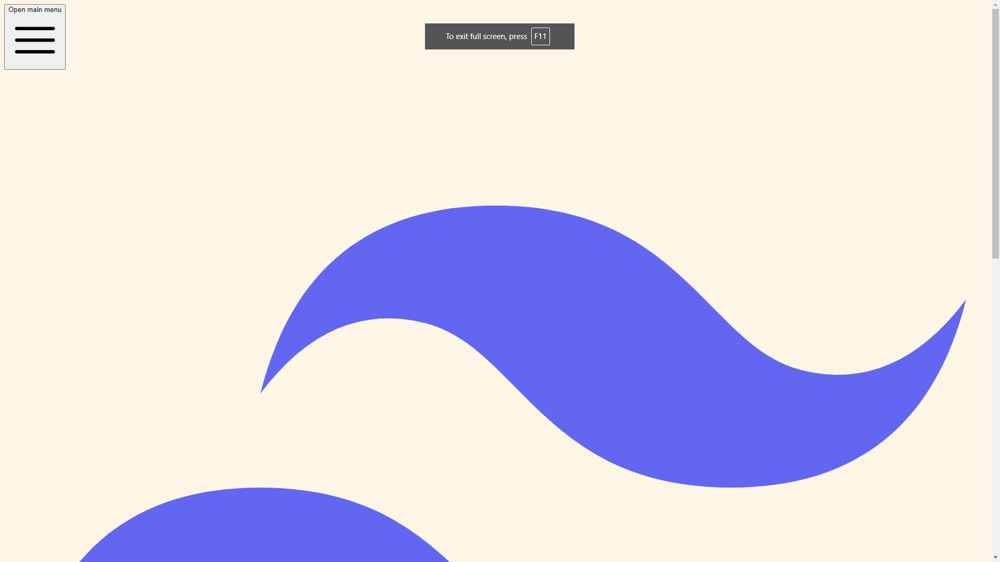
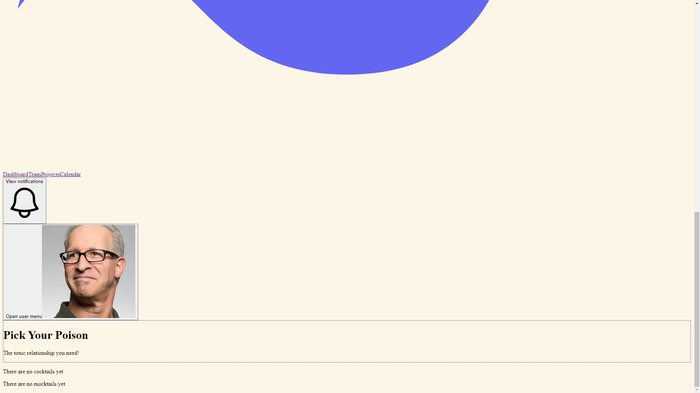

# Pick-ur-poison

# Live URL
[Pick Your Poison](https://pick-ur-poison.onrender.com/)
- `https://pick-ur-poison.onrender.com/`

## Description
Pick-Ur-Poison is a local bar that allows their customers to order drinks with this high-quality application. There are two types of drinks a customer can purchase, which are Cocktails, and Mocktails. Cocktails contain alcohol, and as result, users must sign up and provide their date of birth in order to access the menu. 

## Installation Requirements
This application requires the use of various packages such as express, mongoose, apollo/server with graphql, bcrypt, dotenv, jsonwebtoken, and vite + react for front end.

## Usage
Users must signup to create an account and access menus. From there, users can browse the selection of cocktails and mocktails. Next, click on desired cocktails or mocktails and add items to the cart. Proceed to the cart for checkout. 

### Screenshots

### Contributions
- [Kirsten Barke](https://github.com/kibarke)
    - `https://github.com/kibarke`

- [John Dyitt](https://github.com/jdyitt)
    - `https://github.com/jdyitt`

- [Corbin Ensley](https://github.com/corbinkane) 
    - `https://github.com/corbinkane`

- [Paris Woods](https://github.com/pwoods125) 
    - `https://github.com/pwoods125`
